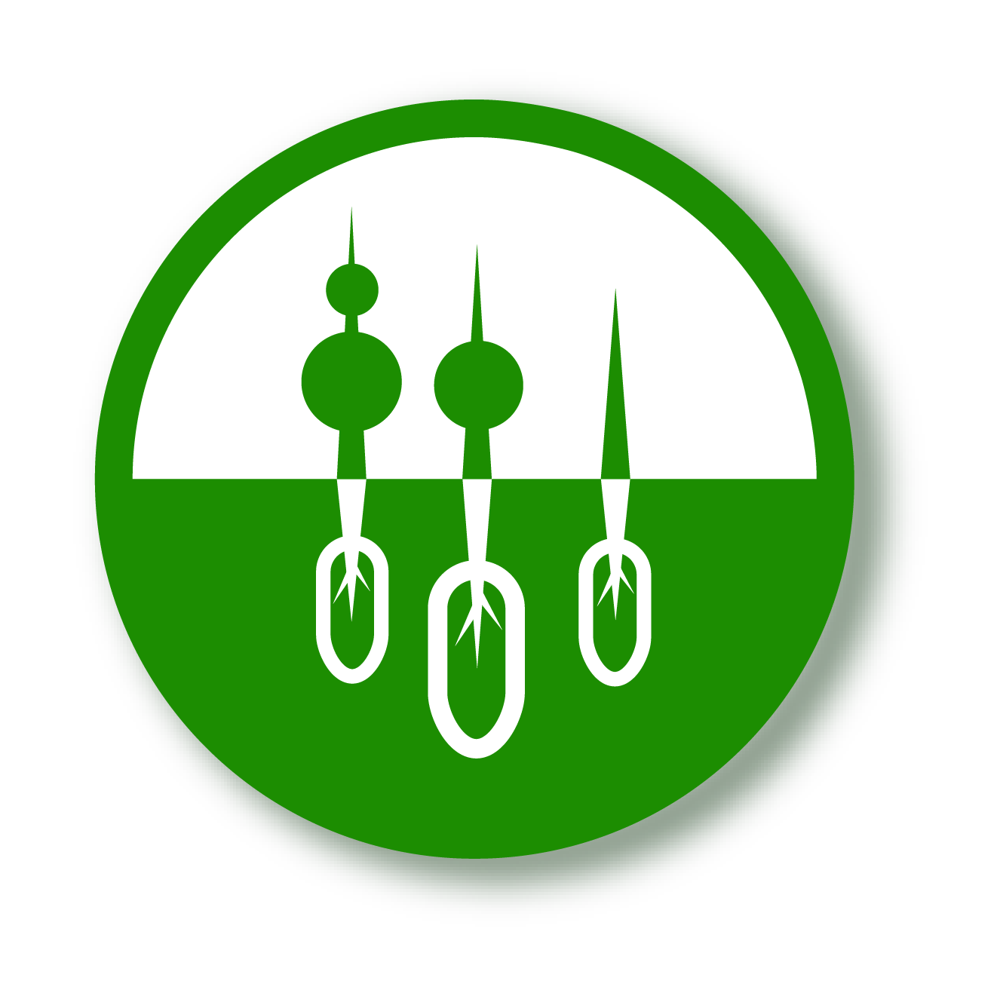

  

# GREEN: Where Farms comes online

GREEN is a website that allow the farms in Kuwait to be available online which is something that is in need during such pandemic such as COVID-19. The website is built with simple and stright forward User Interface that allows the user to navigate and access the material easily. In addition Green allows the farmers to organizer and monitor their own farms by providing a farmers portal. The Farmers portal allows the farmer to add his farms and his products for each farm as well as managing each farm produce. For visitors, GREEN allows them to browse different farms and produces to allow them to later visit that farm or buy products from a specific farm.

The project uses the following technologies:
  - Flask Framework.
  - SQLite3.
  - Azure App Service.

# Features

  - Farmer's Portal: Allow the farmers to manage and monitor their own farms and products.
  - Farms Catalog: Allows the visitors to browse farms in Kuwait.
  - Products Catalog: Allows the visitors to browse products in Kuwait.
  - Useful links page: Allows the visitors to browse important useful links related to agriculture in Kuwait

# License

MIT License

# Copyright Disclaimer

This project is the property of  developers and if used somewhere else the developers must be mentioned and tagged to avoid legal problems.

Developers:
-[@Ayman](https://github.com/AymanKandil)
-[@Mohannad](https://github.com/MohannedOdeh)
-[@Mohammed](https://github.com/Xemonz-Mo)
-[@Ashwaq](https://github.com/Ashwaq85)

**GREEN is a non-profitable application and it is available for free**

